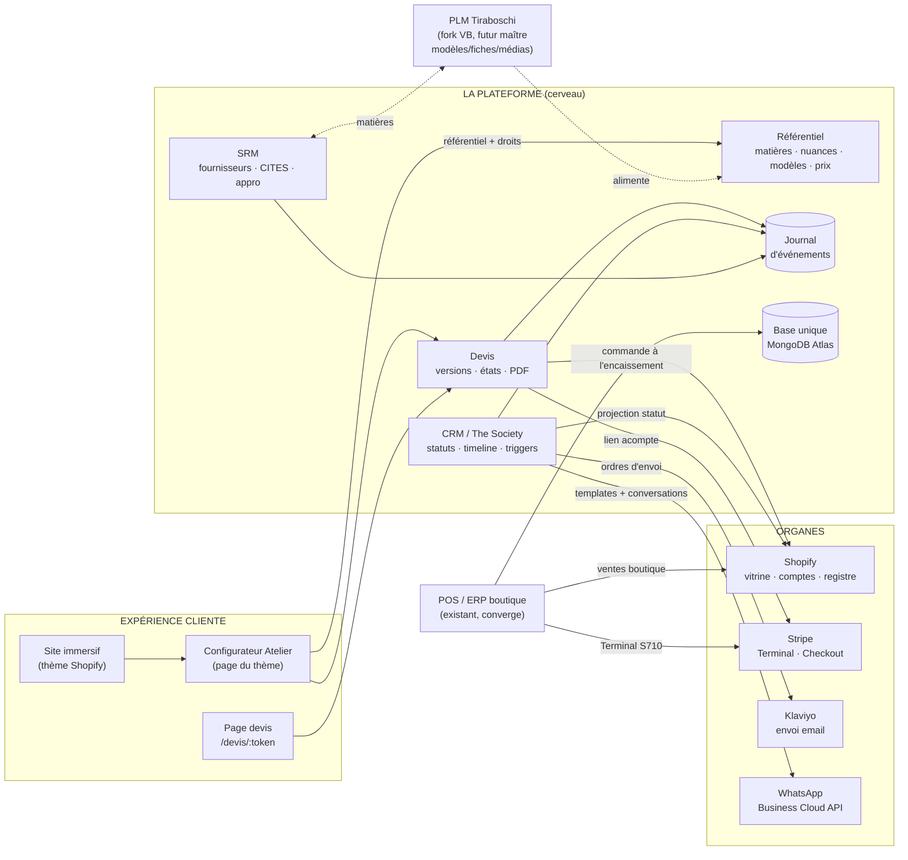
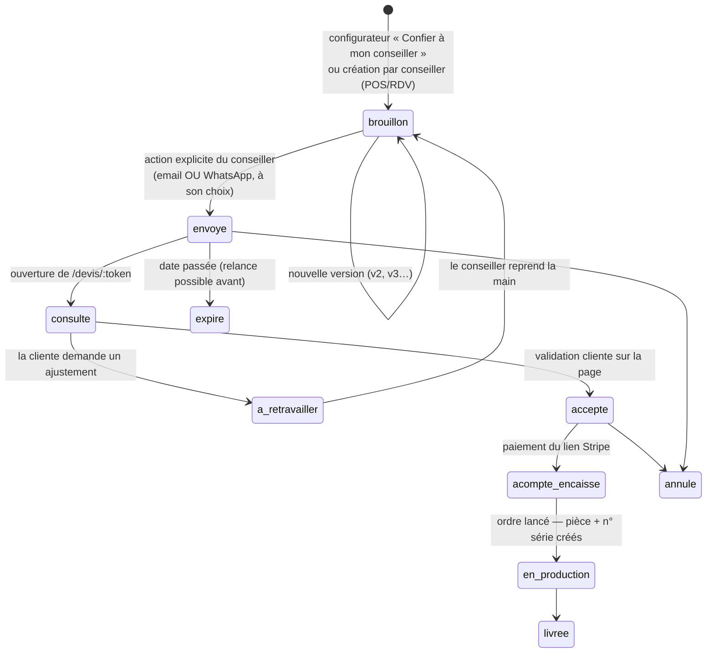

# Écosystème Tiraboschi — Dossier d'architecture
> Version 1.0 — 2026-08-11 · Rédigé pour arbitrage par Vincent Hacquard
> Périmètre : site immersif + configurateur, devis, encaissement, CRM/The Society, SRM, POS, PLM
> Documents liés : `CONTEXT.md` (état du POS), `HANDOFF_V2_SCOPING.md` (audit V2),
> dépôt `tiraboschi.com` (thème Shopify + prototype atelier sur-mesure)

---

## 1 · Principes fondateurs

1. **Un seul cerveau.** Une plateforme unique — appelée ici **la Plateforme** — porte la
   logique métier : référentiel matières, devis, CRM/The Society, SRM, triggers.
   Tout le reste (Shopify, Stripe, Klaviyo, WhatsApp) est un **organe**, jamais un cerveau.
2. **Shopify est rétrogradé** au rang de vitrine (thème, comptes clients, CDN) et de
   **registre comptable** (commandes finales, historique d'achat). Il n'orchestre rien.
   Aucune donnée maîtresse n'y vit ; il reçoit des **projections** (statut The Society en
   metafield, commande créée à l'encaissement).
3. **Pas de vente e-commerce classique.** Le parcours est : immersion → conception
   sur-mesure → devis → validation humaine → acompte → production. Shopify ne voit
   jamais les combinaisons du configurateur ; il ne voit que la commande finale payée.
4. **Une seule base de données, un seul journal d'événements.** Chaque module lit et
   écrit dans la même base ; chaque fait métier est un événement horodaté que les autres
   modules consomment. C'est ce qui fait un écosystème et non des silos.
5. **Aucun message ne part sans décision.** Ni email, ni WhatsApp, ni notification
   ne sont émis par effet de bord d'une manipulation interne. L'envoi est un acte
   explicite (conseiller) ou un trigger **configuré et visible** dans le CRM.
6. **Étanchéité absolue avec VB.** Le PLM Tiraboschi naîtra d'un fork du PLM VB puis
   divergera : dépôts, bases, déploiements, secrets, domaines — tout est séparé.
   Ce qui est partagé, ce sont des **contrats** (formats d'identifiants, noms
   d'événements, formes d'API), jamais du code vivant ni de l'infrastructure.

---

## 2 · Vue d'ensemble



Lecture : les flèches pleines sont des flux de production ; les pointillés arrivent avec
le PLM. La cliente ne voit que la colonne de gauche ; tout le reste lui est invisible.

---

## 3 · La base unique et le journal d'événements

### 3.1 Choix de la base : **MongoDB Atlas** (cluster existant `tiraboschi_pos`)

| Critère | Verdict |
|---|---|
| Déjà provisionné et payé, client déjà branché dans le POS | ✅ zéro coût d'entrée |
| Les données existantes sont déjà en JSON (variants, config, ventes) | ✅ migration = import |
| Documents à géométrie variable (spec de devis, timeline CRM) | ✅ modèle naturel |
| Transactions multi-documents (devis + événement + stock) | ✅ supporté (replica set Atlas) |
| Le Sprint 1 du POS prévoit déjà cette migration | ✅ une seule migration au lieu de deux |

**Décision structurante : le Sprint 1 du POS migre vers la base de l'écosystème**
(database `tiraboschi` sur le cluster existant), pas vers une base à lui. Collections
préfixées par domaine (§4). C'est ce qui évite de migrer deux fois.

### 3.2 Le journal d'événements

Une collection `evenements` en append-only. Chaque fait métier y est écrit **dans la même
transaction** que la donnée qui le produit (pattern outbox), puis des workers le consomment.

```json
{
  "_id": "evt_01J…",
  "type": "devis.accepte",
  "at": "2026-08-11T14:32:00Z",
  "acteur": { "type": "cliente", "ref": "cli_204" },
  "sujet": { "type": "devis", "ref": "DEV-2026-0041", "version": 2 },
  "donnees": { "montant": 6120, "devise": "EUR", "acompte_attendu": 1836 },
  "consommations": { "crm": "2026-08-11T14:32:01Z", "notifications": null }
}
```

- Types nommés en `domaine.fait` : `devis.envoye`, `devis.consulte`, `devis.accepte`,
  `acompte.encaisse`, `production.lancee`, `piece.terminee`, `rdv.planifie`,
  `client.statut_change`, `matiere.seuil_atteint`, `commande_fournisseur.envoyee`…
- Les workers sont **idempotents** (rejouer un événement ne double rien) et marquent
  leur consommation. Pas de bus externe au départ : un poll de la collection suffit
  largement au volume d'une maison de luxe ; l'architecture permet d'en brancher un
  plus tard sans rien changer aux producteurs.
- Le journal EST la timeline CRM : afficher la fiche d'une cliente = filtrer les
  événements qui la concernent. Aucune double saisie.

---

## 4 · Modèle de données (collections)

### 4.1 `ref_matieres`, `ref_nuances`, `ref_modeles` — le Référentiel

Le pont entre le langage du configurateur et celui de l'ERP/PLM. **C'est la table qui
empêche les silos** : un seul enregistrement porte les deux identités.

```json
// ref_matieres
{
  "_id": "caviar",                      // id configurateur
  "code_erp": "CU014",                  // code matière ERP/PLM (canonique)
  "nom": "Caviar", "type": "cuir",
  "supplement": 180, "devise": "EUR",
  "tuile": "shopify://files/cuir-caviar-512.png",
  "visibilite": "public",              // public | societe:2 | societe:3 …
  "cites": false,
  "fournisseurs": ["frn_tannerie_a"]
}
// ref_nuances
{
  "_id": "marine",
  "code_erp": "MA",                     // code couleur canonique
  "nom": "Marine", "hex": "#243352", "ordre": 43,
  "visibilite": "public"
}
// ref_modeles
{
  "_id": "colette",
  "code_erp": "CO",
  "nom": "Colette", "base": 3200,
  "ajustements": ["ext","anse","longueur","int","doublure","ferrures","pieds","bijou","grav","v"],
  "packshot": "shopify://files/BOSCHI0633.jpg",
  "reps": { "ext": [50,60], "v": [50,42] }
}
```

- Une sélection du configurateur `caviar:marine` se traduit mécaniquement en
  SKU canonique **`CO-26H-CU014-XX-MA`** (format déjà acté côté ERP :
  `MODEL-YYS-MAT-OPT-COLOR`). Le devis stocke **les deux** écritures.
- `visibilite` porte le gating The Society : le configurateur reçoit le référentiel
  **déjà filtré** selon la cliente connectée — le voile « réservé au cercle » est
  décidé serveur, jamais dans le JS client.
- Aujourd'hui le Référentiel est saisi dans la Plateforme (import depuis la config ERP
  existante — 47 matières, dictionnaires couleurs/options). Le jour où le PLM Tiraboschi
  est prêt, **il devient producteur** de ces collections ; rien d'autre ne change.

### 4.2 `clients` — identité et Société

```json
{
  "_id": "cli_204",
  "shopify_customer_id": 8123456789,        // identité de connexion au site
  "identite": { "prenom": "…", "nom": "…", "tel_whatsapp": "+33…", "langue": "fr" },
  "societe": {
    "statut": 2,                            // 0 = hors programme · 1..4 = cercles
    "depuis": "2026-03-02",
    "ca_cumule": 23400,
    "conseiller": "USR-2",
    "regles_gelees": false                  // vrai si statut attribué manuellement
  },
  "type": "b2c",                            // b2c | b2b (conciergeries, hôtels, corporate)
  "preferences": { "matieres": ["alligator"], "canal": "whatsapp" },
  "rgpd": { "email_optin": true, "whatsapp_optin": true, "maj": "2026-06-01" }
}
```

- Le POS et le site continuent de créer les comptes via Shopify ; la Plateforme
  rattache et enrichit. **La fiche riche vit ici**, Shopify n'a que l'identité.
- Projection sortante : `societe.statut` est poussé en **metafield Shopify**
  (`tiraboschi.society_statut`) à chaque changement — le thème et le configurateur
  le lisent nativement (Liquid), zéro appel supplémentaire au rendu.

### 4.3 `devis` — l'objet central du parcours sur-mesure

```json
{
  "_id": "DEV-2026-0041",
  "client": "cli_204",
  "conseiller": "USR-2",
  "etat": "envoye",                          // machine à états — §5
  "token_client": "9f2c…",                   // URL /devis/9f2c… — non devinable, révocable
  "expire_le": "2026-09-10",
  "version_courante": 2,
  "versions": [
    {
      "n": 2, "cree_le": "…", "par": "USR-2",
      "spec": {                              // sortie EXACTE du configurateur
        "modele": "colette",
        "choix": {
          "ext":  { "sel": "caviar:marine", "sku": "CU014-MA", "supplement": 180 },
          "ferrures": { "sel": "or24", "supplement": 1800 },
          "grav": { "sel": "V.T.", "supplement": 180 }
        }
      },
      "prix": { "base": 3200, "supplements": 2160, "total": 5360, "devise": "EUR",
                "taxes": { "mode": "DDP-US", "montant": 482, "source": "draft_order_silencieux" },
                "acompte": { "pct": 30, "montant": 1608 } },
      "pdf": "s3://…/DEV-2026-0041-v2.pdf",
      "note_conseiller": "Remplacement doublure après échange du 10/08"
    }
  ],
  "sku_prevu": "CO-26H-CU014-OR-MA",
  "commande_shopify": null,                  // renseigné à l'encaissement seulement
  "ordre_production": null
}
```

### 4.4 Autres collections

| Collection | Rôle | Points clés |
|---|---|---|
| `pieces` | Une pièce physique = un **numéro de série** | naît à `production.lancee`, états En prod → QC → Livrée → SAV ; lie devis, matières consommées (BOM), artisan, cliente. Socle du passeport produit et de l'anti-contrefaçon |
| `rdv` | RDV à domicile, showrooms, trunk shows | lieu, date, conseiller, clientes invitées/venues, compte-rendu → événements `rdv.*` dans les timelines |
| `fournisseurs` | SRM | tanneries/ateliers, contacts, délais, MOQ, **certificats CITES par lot** (obligatoire alligator/galuchat), historique commandes |
| `commandes_fournisseur` | appro matières | liées aux seuils du stock ERP (`matiere.seuil_atteint` → proposition de commande) |
| `triggers` | règles d'automatisation CRM | voir §7.3 — données, pas code : modifiables sans déploiement |
| `pos_*` | collections migrées du POS (Sprint 1) | `pos_variants`, `pos_stock`, `pos_ventes`, `pos_users`, `pos_config` — mêmes données qu'aujourd'hui, enfin persistantes |

---

## 5 · Le pipeline devis — remplaçant assumé des Draft Orders

### 5.1 Machine à états



### 5.2 Règles qui corrigent les défauts de Draft Orders

| Défaut Draft Orders constaté | Réponse de la Plateforme |
|---|---|
| Email de confirmation parti trop tôt / au mauvais moment | **Aucun envoi implicite.** Seul `envoyer` déclenche un message ; créer, corriger, versionner sont silencieux |
| Erreur = tout recommencer, la cliente a déjà reçu un email | On émet une **v2** ; l'URL `/devis/:token` est unique et montre toujours la version courante — la cliente ne voit jamais d'incohérence |
| Brouillon → commande = bascule à sens unique, suivi pauvre | La machine à états ci-dessus, avec journal complet (qui, quoi, quand) et retour arrière propre (`a_retravailler`) |
| Document sans allure | Page de validation dans l'univers du site (même langage que l'écran certificat de l'atelier) + **PDF à la charte** (puppeteer, déjà en dépendance du POS) |
| Pas d'expiration, pas de relance | `expire_le` + triggers CRM (`devis.consulte` sans suite à J+7 → relance discrète programmable) |

### 5.3 Encaissement et registre

- `accepte` → génération du **lien Stripe Checkout existant du POS** (y compris la page
  `/pay/:id` qui contourne les navigateurs intégrés WhatsApp/Instagram — déjà en prod).
- `checkout.session.completed` (webhook déjà signé) → `acompte.encaisse` → **c'est ici,
  et seulement ici, que la commande Shopify est créée** : payée partiellement, taguée
  `sur-mesure`, ligne unique au SKU canonique. Reporting commercial unifié (boutique +
  sur-mesure) sans double comptage ni brouillons fantômes.
- Taxes internationales : le mécanisme Draft Order du POS est conservé comme
  **calculateur silencieux** (création → lecture des taxes → suppression immédiate),
  jamais exposé à la cliente. Rien à réinventer, aucun email Shopify possible.

---

## 6 · Contrats d'API

### 6.1 Identifiants canoniques (communs à tout l'écosystème, PLM compris)

| Objet | Format | Exemple |
|---|---|---|
| SKU pièce | `MODEL-YYS-MAT-OPT-COLOR` | `CO-26H-CU014-OR-MA` |
| Sélection configurateur | `matiere:nuance` | `caviar:marine` |
| Devis | `DEV-AAAA-NNNN` | `DEV-2026-0041` |
| Numéro de série | `TS-AAAA-NNNNN` | `TS-2026-00214` |
| Client | `cli_…` + `shopify_customer_id` | — |
| Événement | `domaine.fait` | `devis.accepte` |

### 6.2 Endpoints de la Plateforme

```
— Référentiel (consommé par le configurateur, servi filtré par statut) —
GET  /api/referentiel?client={token}      → modèles + matières + nuances visibles, prix

— Devis —
POST /api/devis                            (spec du configurateur → brouillon)
POST /api/devis/:id/versions               (nouvelle version)
POST /api/devis/:id/envoyer                { canal: "email" | "whatsapp" }
GET  /devis/:token                         (page publique cliente — HTML)
POST /devis/:token/accepter | /retravailler
GET  /api/devis/:id/pdf

— CRM —
GET  /api/clients/:id/timeline             (événements filtrés)
POST /api/clients/:id/statut               (changement manuel → projection Shopify)
POST /api/rdv                              (RDV / showroom / trunk show)
POST /api/hooks/whatsapp                   (webhook Meta — messages entrants → timeline)

— SRM —
POST /api/fournisseurs · /api/commandes-fournisseur
POST /api/lots-matiere/:id/cites           (dépôt certificat)

— Existant POS conservé tel quel —
/api/create_payment_link · /pay/:id · /api/webhook (Stripe)
/api/shopify/calculate_taxes               (calculateur silencieux)
```

### 6.3 Ce que le PLM devra parler (contrat, pas code)

Le PLM Tiraboschi — fork VB, totalement étanche — devient producteur du Référentiel via
un contrat unique : `PUT /api/referentiel/import` (payload = collections §4.1 complètes,
identifiants canoniques §6.1). S'il sait produire ce payload, l'écosystème ne voit pas
la différence. Aucune autre surface de contact.

---

## 7 · The Society — CRM, triggers, canaux

### 7.1 Répartition des rôles — pourquoi Shopify seul ne suffit pas

| Besoin | Où ça vit |
|---|---|
| Identité, connexion au site, historique d'achat | Shopify (comptes clients) |
| Statuts, règles de passage, privilèges, timeline, RDV | **Plateforme (CRM)** — c'est votre code, personnalisation totale |
| Gating matières/modèles dans le configurateur | Référentiel filtré serveur (§4.1) + metafield projeté pour le thème |
| Envoi d'emails au design maison | **Klaviyo** (compte existant, prévu Phase 4 du site) — la Plateforme décide *quand/quoi* (événement), Klaviyo exécute *l'envoi* |
| Canal conseiller dédié | **WhatsApp Business Cloud API** (Meta) — intégration directe de la Plateforme, conversations rattachées à la timeline |
| Triggers B2C **et** B2B, entièrement personnalisables | Collection `triggers` (§7.3) — des données, modifiables sans déploiement |

### 7.2 Statuts et privilèges (spec existante du programme, inchangée)

Cercles 1→4 selon CA cumulé (10 k / 20 k / 50 k / 100 k€), jamais exprimés en points ni
remises. Privilèges appliqués **mécaniquement** par l'écosystème : avant-premières
(trigger d'invitation), matières exclusives (`visibilite: "societe:3"` dans le
Référentiel → l'ascenseur de nuances voile le cran), pièce d'exception (cercle 4 →
RDV conception avec la fondatrice). Passage de cercle = `client.statut_change` →
projection Shopify + message du conseiller (jamais un email automatique froid).

### 7.3 Triggers — modèle de données, exemples

```json
{
  "_id": "trg_relance_devis",
  "actif": true, "cible": "b2c",
  "quand": { "type": "devis.consulte", "sans_suite_depuis_jours": 7 },
  "condition": { "societe.statut": { "$gte": 1 } },
  "action": { "canal": "tache_conseiller",
              "modele": "relance_discrete" },
  "garde_fou": { "max_par_client_par_mois": 1 }
}
```

| Déclencheur | Cible | Action type |
|---|---|---|
| `acompte.encaisse` | B2C | WhatsApp du conseiller : remerciement + délai de façonnage |
| `piece.terminee` | B2C | Email Klaviyo « votre pièce quitte l'atelier » + passeport produit |
| `client.statut_change` (cercle 2) | B2C | Tâche conseiller : annoncer la carte physique |
| nouveauté taguée cercle ≥ 2 | B2C | Invitation avant-première (choix canal selon préférence cliente) |
| `rdv.showroom_planifie` | B2C/B2B | Invitations WhatsApp template + suivi réponses en timeline |
| stock pièce B2B disponible | B2B | Email dédié conciergeries/hôtels |
| `devis.expire` imminent | B2C | Tâche conseiller (jamais d'email automatique sur un devis de ce niveau) |

Un garde-fou global limite la pression commerciale par cliente ; le canal par défaut
respecte `preferences.canal` et les opt-ins RGPD.

### 7.4 WhatsApp Business Cloud API — réalités d'implémentation

- Prérequis : compte Meta Business vérifié, numéro dédié, **templates de messages
  approuvés par Meta** pour tout envoi sortant hors fenêtre de 24 h (invitation,
  devis envoyé, pièce prête…). Prévoir la rédaction/validation des templates tôt.
- Entrants : webhook → `POST /api/hooks/whatsapp` → rattachement à la cliente par
  numéro → timeline. Le conseiller répond depuis le CRM (fenêtre 24 h libre).
- L'envoi du devis par WhatsApp = template + lien `/devis/:token` (la page publique
  gère déjà le navigateur intégré grâce au pattern `/pay/:id` du POS).

---

## 8 · Intégration du configurateur dans Shopify

Le prototype (`tiraboschi-atelier-prototype.html`) est intégrable tel quel : vanilla
JS sans build, plein écran, recetté sur 3 fenêtres (36 cas). Travaux de production :

1. **Template** `page.atelier.json` + section `tira-atelier.liquid` dans le thème
   (dépôt `tiraboschi.com`, déjà sous notre contrôle, déploiement GitHub→Shopify actif).
2. **Assets** : les 6 tuiles matières (photos client, ~1,3 Mo aujourd'hui inline) et
   packshots partent sur le CDN Shopify (`shopify://files/…`).
3. **Données** : suppression des constantes TYPES/COULEURS/MODELES du HTML → un appel
   `GET /api/referentiel` au chargement (déjà filtré par statut, §4.1).
4. **Identité** : la section Liquid injecte `customer.id` + un jeton signé → le
   configurateur parle à la Plateforme au nom de la cliente connectée.
5. **Sortie** : « Confier à mon conseiller » → `POST /api/devis` (remplace l'alerte
   de démonstration actuelle). L'expérience visuelle, elle, ne change pas.

---

## 9 · Convergence du POS existant

Le POS reste en production sans interruption ; il converge par étapes :

| Étape | Contenu | Note |
|---|---|---|
| **C0 — préalables** | corriger la syntax error `server.js` l.118, compléter `.env` (`MONGO_URI`, `STRIPE_WEBHOOK_SECRET`, `ALLOWED_ORIGINS`), trancher l'auth Shopify (`client_credentials` → token), auditer le `prestart` qui rejoue des migrations à chaque boot | prérequis à tout déploiement serein |
| **C1 — données** (= Sprint 1 réorienté) | migration JSON → **base écosystème** (`tiraboschi`, collections `pos_*`), écritures atomiques, backup préalable des JSON (peut-être les seules données vivantes) | supprime LE risque de perte de données Render |
| **C2 — sécurité** | bcrypt + JWT + rate limiting (Sprint 2 inchangé) | bloquant avant d'ouvrir la Plateforme à plus d'utilisateurs |
| **C3 — devis** | le back-office devis (création, versions, envoi, suivi) s'ajoute comme module de l'app POS existante (même SPA, même auth) | les conseillers gardent UN outil |
| **C4 — CRM/RDV** | timeline, statuts, triggers, WhatsApp dans le même back-office | le module CRM actuel (basique) est remplacé |
| **Invariants** | Stripe Terminal S710, liens de paiement `/pay/:id`, calcul taxes, wizard de vente : **ne bougent pas** | listés « à ne pas casser » dans `CLAUDE.md` du POS |

---

## 10 · Étanchéité PLM VB ↔ Tiraboschi

| Dimension | Règle |
|---|---|
| Code | Fork unique à date taguée, puis divergence libre. Pas de dépôt commun, pas de package partagé, pas de « lib commune » qui recréerait un couplage |
| Infrastructure | Bases, hébergements, domaines, comptes de service, secrets : distincts. Aucun service mutualisé |
| Données | Aucune donnée d'une maison ne transite par l'autre, même anonymisée |
| Correctifs | Un fix de sécurité côté VB peut être **rejoué manuellement** côté Tiraboschi (cherry-pick assumé), jamais automatiquement |
| Ce qui est commun | Les **contrats** : formats d'identifiants (§6.1), payload `referentiel/import` (§6.3), noms d'événements. Deux implémentations, une grammaire |

---

## 11 · Séquencement

```
J0  ── C0 préalables POS (jours)
 │
 ├─ J1 ── C1 migration base écosystème (le POS devient durable)          ← urgence réelle
 │
 ├─ J2 ── Pipeline devis de bout en bout :
 │         configurateur intégré au thème → POST /api/devis → back-office
 │         → /devis/:token → acompte (lien Stripe existant) → commande Shopify
 │         → timeline. PDF à la charte.                                   ← premier CA sur-mesure
 │
 ├─ J3 ── The Society v1 : statuts + projection metafield + gating
 │         configurateur + triggers « tâche conseiller » + Klaviyo branché
 │
 ├─ J4 ── WhatsApp Cloud API (vérification Meta + templates en parallèle dès J2)
 │         + C2 sécurité + numéros de série (`pieces`) à la première prod devis
 │
 └─ J5 ── SRM v1 (fournisseurs, CITES, commandes matières)
           puis PLM Tiraboschi (fork VB) → producteur du Référentiel
```

Chaque jalon livre un parcours complet utilisable, pas une couche technique.

### Risques principaux

| Risque | Parade |
|---|---|
| Les JSON du POS effacés par un redeploy Render **avant** C1 | backup immédiat en C0, C1 en priorité absolue |
| Validation Meta des templates WhatsApp (délais, refus) | démarrer la vérification business dès J2 ; les triggers tombent en « tâche conseiller » tant que le canal n'est pas ouvert |
| Divergence référentiel configurateur ↔ ERP pendant la transition | la table de correspondance (§4.1) est créée en J2 et devient la seule source ; interdiction d'ajouter une matière ailleurs |
| Auth Shopify `client_credentials` fragile | bascule token en C0 (une ligne, déjà documentée) |
| Le back-office grossit dans une SPA monolithique | accepté court terme (décision actée « vanilla, pas de build ») ; découpage en modules ES6 déjà au backlog Sprint 5 |

---

## 12 · Décisions à acter

- [x] Un cerveau (Plateforme), Shopify = vitrine + registre — *acté dans ce dossier*
- [x] Devis maison, Draft Orders réduit au calcul de taxes silencieux — *acté*
- [x] PLM : fork VB, étanchéité totale, contrats communs — *acté*
- [ ] **D1** — Base unique : MongoDB Atlas, database `tiraboschi`, le Sprint 1 du POS migre vers elle (recommandé §3.1)
- [ ] **D2** — Acompte sur-mesure : pourcentage (30 % proposé) et politique d'expiration des devis (30 jours proposés)
- [ ] **D3** — Le back-office devis/CRM vit dans l'app POS existante (recommandé §9-C3) plutôt qu'une deuxième interface
- [ ] **D4** — Numéro WhatsApp dédié + lancement de la vérification Meta Business dès J2
- [ ] **D5** — Codes ERP à attribuer aux 6 matières et 52 nuances du configurateur (table §4.1 — atelier d'une heure avec l'inventaire existant, 47 matières déjà codées)

---

*Dossier v1.0 — à faire vivre comme `CONTEXT.md` : toute décision prise est reportée ici.*
